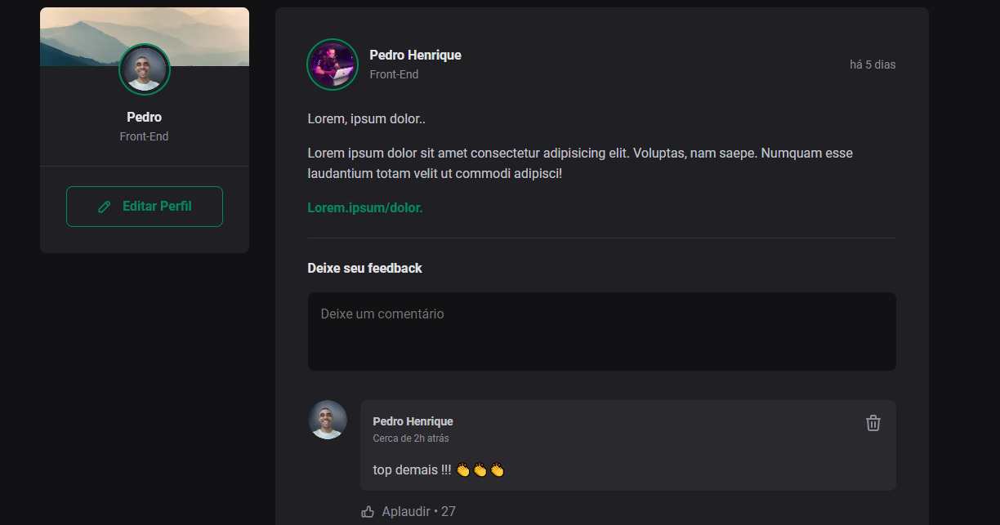

<h1 align="center"> Feed </h1>

Este projeto foi feito em aula do curso da RocketSeat.  

  <a href="#-tecnologias">Tecnologias</a>&nbsp;&nbsp;&nbsp;|&nbsp;&nbsp;&nbsp;
  <a href="#-projeto">Projeto</a>

 

  

## 🚀 Tecnologias

Esse projeto foi desenvolvido com as seguintes tecnologias:

- ReactJs
- Styled-Components
- TypeScript
- Git e Github

## 💻 Projeto

Projeto feito para imitar um feed.

---

## Instruções
### Primeiros passos:

Depois de baixar o arquivo no [GitHub](https://github.com/pdro-h0/feed.git) no seu terminal, execute o seguinte comando na pasta raiz:

`npm install`

Após o primeiro passo, rode o comando no terminal para iniciar o projeto:

`npm run dev`

Depois disso, o projeto ja estará rodando no seu navegador.

---

Feito com ♥ by Pedro Henrique